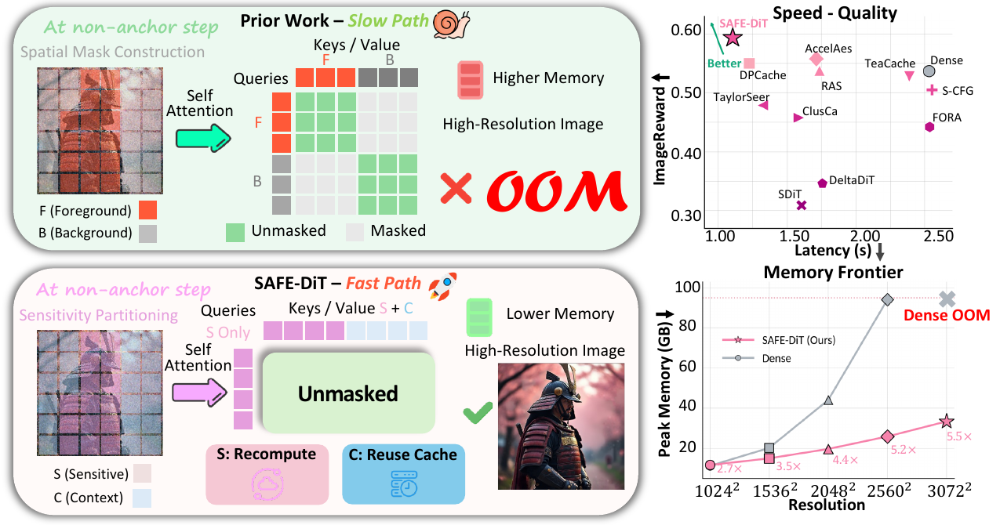
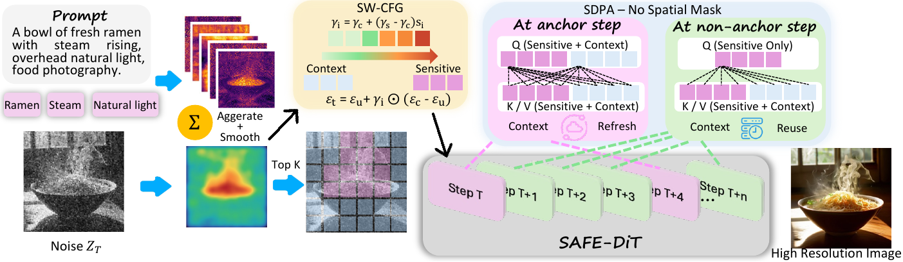
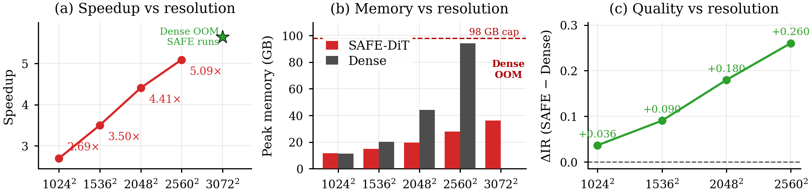
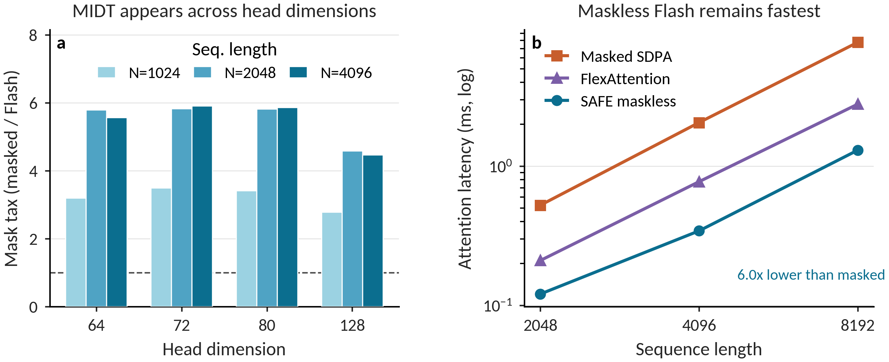
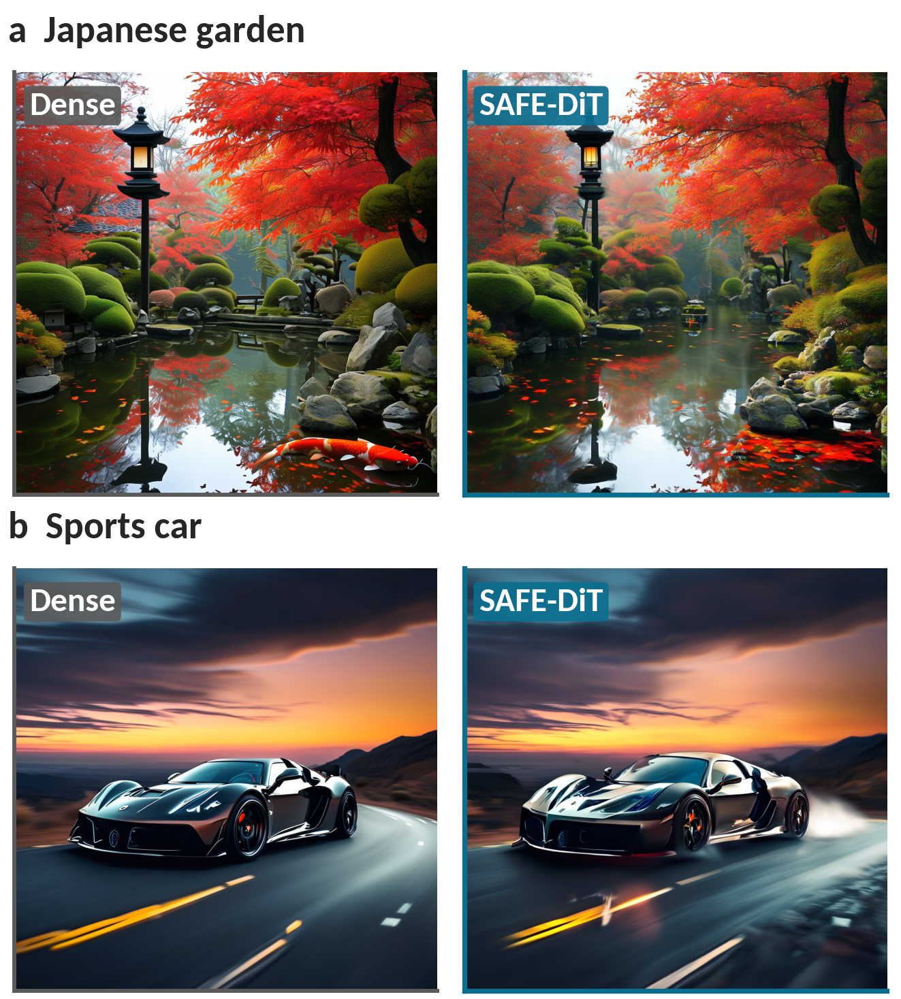

<div align="center">

# SAFE-DiT: Semantics-Aware Fast-path Execution for High-Resolution Diffusion Transformers

**A runnable implementation of SAFE-DiT primitives, exact mask elision, sparse token scheduling, spatial guidance, and MIDT benchmarking.**

[Installation](#installation) | [Quick Start](#quick-start) | [Benchmark](#midt-benchmark) | [Method](#method-overview) | [Repository Layout](#repository-layout)

</div>

<p align="center">
  
</p>

SAFE-DiT accelerates high-resolution diffusion transformers by separating
semantics-preserving fast-path execution from approximation-based spatial
scheduling. The code in this repository is lightweight and directly runnable:
it includes the certified attention-mask rewrite, prompt-conditioned token
selection, selective token update, spatially weighted guidance, toy DiT
integration, and a PyTorch SDPA benchmark for measuring mask-induced dispatch
tax.

## Method Overview

<p align="center">
  
</p>

SAFE-DiT contains four implementation pieces:

- `Mask elision`: removes only provably redundant attention masks. An all-valid
  image self-attention mask is mathematically equivalent to no mask, while
  padding, causal, block, and non-uniform bias masks are kept.
- `PCSP`: partitions image tokens using prompt-conditioned image-to-text
  attention sensitivity.
- `SRSU`: refreshes sensitive tokens while reusing context-token states between
  anchor steps.
- `SW-CFG`: applies spatially weighted classifier-free guidance so sensitive
  regions receive stronger guidance than context regions.

<p align="center">
  
  
</p>

## Installation

The smoke tests run on CPU. CUDA is recommended for the MIDT benchmark.

```bash
python -m venv .venv
. .venv/bin/activate
pip install -r requirements.txt
```

If you need a specific CUDA build, install the matching PyTorch wheel first,
then run `pip install -r requirements.txt`.

## Quick Start

Run the end-to-end smoke test:

```bash
python -m safe_dit.demo --device auto
```

Expected output is a JSON summary with exactness, scheduling, selective-update,
and guidance checks.

Run a toy DiT block that uses the SAFE-DiT primitives:

```bash
python examples/toy_dit_block.py --device auto
```

Or use the convenience script:

```bash
bash scripts/run_demo.sh
```

## MIDT Benchmark

Measure the latency and memory effect of passing an all-valid boolean mask into
PyTorch SDPA:

```bash
python -m safe_dit.sdpa_benchmark --device auto --seq-lens 512 1024 --head-dims 64 72
```

For larger GPUs:

```bash
python -m safe_dit.sdpa_benchmark --device cuda --seq-lens 2048 4096 8192 --head-dims 64 72 128
```

The benchmark compares SDPA with no mask against SDPA with an all-valid mask.
The two calls are mathematically equivalent for self-attention, but they can
dispatch to different kernels and therefore have different latency and memory
behavior.

## Qualitative Results

<p align="center">
  
</p>

## Using The Components

```python
import torch
from safe_dit import (
    safe_scaled_dot_product_attention,
    prompt_conditioned_sensitivity,
    select_sensitive_tokens,
    srsu_update,
    sensitivity_weighted_cfg,
)

q = torch.randn(1, 8, 1024, 64, device="cuda")
k = torch.randn(1, 8, 1024, 64, device="cuda")
v = torch.randn(1, 8, 1024, 64, device="cuda")
mask = torch.ones(1, 8, 1024, 1024, dtype=torch.bool, device="cuda")

out = safe_scaled_dot_product_attention(q, k, v, mask)
```

## Repository Layout

```text
SAFE-DiT/
  assets/                  # Paper figures used by the README
  examples/
    toy_dit_block.py       # Minimal DiT-style integration example
  safe_dit/
    mask_semantics.py      # Exact attention-mask removal criterion
    scheduler.py           # PCSP, SRSU, CAR, and SW-CFG primitives
    demo.py                # End-to-end smoke test
    sdpa_benchmark.py      # Masked vs. mask-free SDPA benchmark
  scripts/
    run_demo.sh
    run_midt_benchmark.sh
  requirements.txt
```

## Citation

The final BibTeX entry will be added with the camera-ready venue metadata.
